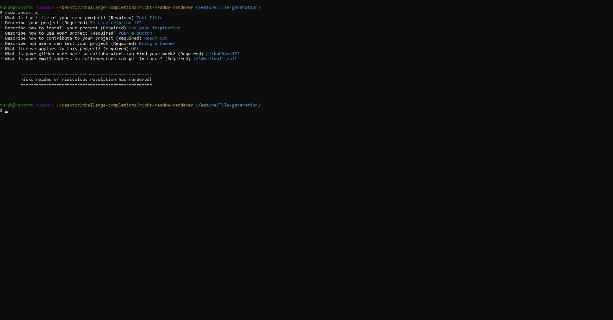

# Ricks README Renderer
  

## Description

This repo contains a javascripting app that utilizes the node.js environment to prompt a user with a series of questions and dynamically creating a "README.md" file based on the answers to the previous questions. This dynamically generated file is placed at the root of the javascripting app.

[README Generator](https://rickhill543.github.io/ricks-readme-renderer/)

***

## Table of Contents

* [Installation](#installation)

* [Usage](#usage)

* [License](#license)

* [Contributing](#contributing)

* [Tests](#tests)

* [Questions](#questions)

***

## Installation

To run the README generator, copy, clone, or fork this repository and then run the bash command "node index.js" in the root of the application to begin. Application requires the fs and inquirerer dependencies. To install the inquirer package, run the following commands... "npm init" followed by "npm install inquirer". This will setup the necesary packages required by the README application.

***

## Usage 

This application is used to help speed up development workflow by cutting down on time used for a redundant task, the mundane yet neccesary README.md file used to describe all your projects. By prompting the user with the familiar set of questions usually found in a README file, the file can be generated in just a minute or so in a clean and reapeatable format. Simply answer all the questions and voila! A brand new README file will be generated at the root of the application.

Here's a video of the process: https://drive.google.com/file/d/1nS5xmD6qgYakakilhAxw0z7F_7aWzlHL/view

***

## License

This project is covered under the MIT license

Massachusetts Institute of Technology (MIT) License is free license software. The MIT License grants the software end user rights such as copying, modifying, merging, distributing, etc. It is notable for what it does not contain, such as clauses for advertising and prohibition of the use of the copyright owner’s name for promotional uses. The MIT License is a free and open source software similar to the Berkeley Software Distribution (BSD) License.

-------------------------------------------------------------------
Here is a Wikipedia article on the license for further information:
https://en.wikipedia.org/wiki/MIT_License

## Contributing

Contributions can be made in any measure for any reason. Copy, clone, or fork this repository and and follow the installation instructions to get started! See contact information below for any questions.

***

## Tests

After initializing the application, test out different answers to the prompt series. Try different license options and notice their corresponding changes. Test out potential code breaking inputs as well.

***

## Questions

Checkout my GitHub profile [here](https://github.com/rickhill543/)

If you have any questions, you can email me at: rickhill543@gmail.com

